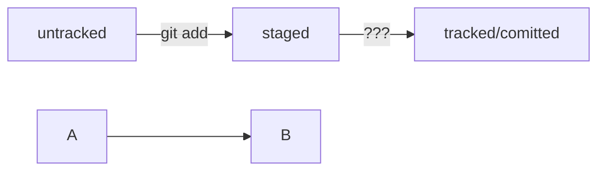

# GIT - Git - это консольная утилита, для отслеживания и ведения истории изменения файлов, в вашем проекте. Чаще всего его используют для кода, но можно и для других файлов. 

## _Инициализируем репозиторий_

### Сделать папку репозиторием — _git init_

Переходим в папку, которую хотим сделать репозиторием и выполняем команду _git init_

_git init_ выведет сообщение вида _Initialized empty Git repository in <*ваша папка с проектом*>/.git/_  
*(англ. «инициализирован пустой Git-репозиторий в <_ваша папка_>/.git/»).* В подпапке .git Git будет хранить всю служебную информацию.

Команда _git init_ — одна из редко применяемых, ведь репозиторий создаётся один раз, а пользоваться им можно сколько угодно долго.

«Разгитить» папку, если что-то пошло не так, — rm -rf .git

## Проверить состояние репозитория — _git status_

Команда _git status_ выведет:

1. название текущей ветки: _On branch master_ или _On branch main_;

2. сообщение о том, что в репозитории ещё нет коммитов: _No commits yet_;

3. сообщение, которое говорит: «чтобы что-нибудь закоммитить (то есть зафиксировать), нужно сначала это создать» — _nothing to commit (create/copy files and use "git add" to track)_.

В отличие от _git init_, команду _git status_ используют часто. В любой непонятной ситуации стоит посмотреть состояние (статус) репозитория, а потом решить, что делать дальше.

## _Добавляем файлы в репозиторий_

### Подготовить файлы к сохранению — _git add_

Если создать/добавить какие то файлы в локальный репозиторий, то после вызова команды _git status_ Git сообщит что в такой то папке есть _untracked files_ - (неотслеживаемые файлы). Это состояние означает, что GIT ещё не хранит информацию о версиях файла и не может отследить, как он изменился.

Команда _git add --all_ подготавливает все файлы в репозитории к сохранению.
Можно и какой то отдельный файл или файлы по отдельности командой _git add readme.txt_
Либо всю папку целиком _git add ._

После такой команды, если вызвать команду _git status_, то мы увидем, что файлы начали отслеживаться.

Команда _git add_ не сохраняет содержимое файлов в репозитории. Само сохранение, или фиксацию состояния файлов, называют коммитом (от англ. commit — «совершать», «фиксировать»). «Сделать коммит» значит сохранить текущую версию файла.

Если сейчас отредактировать какой то из отслеживаемых файлов, то он перейдет в состояние _modified_ и будет и в зеленом и в красном списках.

Зеленым отмечена изначальная(предыдущая) версия файла - в таком виде он был во время последнего запуска команды _git add_

Красным отмечена измененная версия.

### Делаем коммит *git commit*

Коммит — это одна из основных сущностей в Git (и в других системах контроля версий). Коммит гарантирует, что изменения будут сохранены в истории и при необходимости к ним можно будет «откатиться».

Сделать коммит можно командой _git commit_ c ключом _-m_

Обычно в таком сообщении поясняется, в чём именно состояли изменения. Это как заметки на полях: благодаря им проще читать и понимать текст. Сообщение коммита выполняет те же функции — улучшает понимание и упрощает навигацию. Оно пишется после ключа -m в кавычках.

* _git commit -m_ "Мой первый коммит!"

* _[master (root-commit) baa3b6e]_ значит:
коммит был в ветке _master_
_root-commit_ — это самый первый, или «корневой» (англ. root), коммит в ветке, у следующих коммитов такой надписи не будет;
_baa3b6e_ — сокращённый идентификатор коммита (подробнее об этом мы ещё расскажем)

* _files changed, 1 insertion(+)_ значит:
изменились два файла (readme.txt и todo.txt);
одна строка была добавлена (1. Пройти пару уроков по Git.).

* Строки вида create mode 100644 readme.txt — это более подробная информация о новых (добавленных в Git) файлах.
_create_ (англ. «создать») говорит, что файл был создан. Если бы файл был удалён, на этом месте было бы слово delete (англ. «удалить»).
_mode 100644_ сообщает, что это обычный файл. Также возможны варианты _100755_ для исполняемых файлов (например, что-нибудь.exe) и _120000_ для файлов-ссылок в Linux. Файлы-ссылки не содержат данных сами по себе, а только ссылаются на другие файлы — как «ярлыки» в Windows.

Обратите внимание: после того как вы сделали первый коммит, команда *_git status_* перестала выводить сообщение _No commits yet_

## Просматриваем историю коммитов _*git log*_

## _GIT HUB_

### Создаём удалённый репозиторий

* Зайдите в свой профиль по ссылке https://github.com/username, где username — имя, которое вы указали при регистрации.
* Создайте репозиторий. Для этого перейдите на вкладку _Repositories_ и нажмите на зеленую кнопку _New_
* Открылось окно для создания нового репозитория, вводим имя и нажимаем *Create repository\*
Готово

### _Связываем локальный и удалённый репозитории *git remote add*_

*Перейдите на страницу удалённого репозитория, выберите тип SSH и скопируйте URL. Кнопка справа позволит сделать это мгновенно.
*Откройте консоль, перейдите в каталог локального репозитория и введите команду _git remote add origin url репозитория_

### Убедиться, что репозитории связаны, — _git remote -v_

### Синхронизируем локальный и удалённый репозитории

Самая первая ветка в репозитории появляется автоматически и называется main (англ. «основная») или master. Её имя нужно указывать при отправке коммитов на удалённый репозиторий или при получении их из него.

### Отправить изменения на удалённый репозиторий — _git push_

Вы уже прошли весь «цикл коммита»: подготовили файлы с помощью _git add_, закоммитили их с комментарием командой _git commit -m_. Осталось загрузить содержимое локального репозитория на GitHub. За это отвечает команда _git push_
В первый раз эту команду нужно вызвать с флагом _-u_ и параметрами _origin_ (имя удалённого репозитория) и _main или master_ (название текущей ветки). Флаг _-u_ свяжет локальную ветку с одноимённой удалённой. Как вы связывали локальный и удалённый репозитории в предыдущем уроке, так же и здесь нужно дополнительно связать ветки.

```
git push -u origin main
```

При взаимодействии с удалёнными репозиториями Git выводит в консоль отладочную информацию: количество объектов (файлов), которые отправляются на сервер, информацию о прогрессе сжатия и записи и так далее.
Если вы указывали кодовую фразу при настройке SSH-ключей, её нужно будет ввести.

В дальнейшем при работе с удалённым репозиторием флаг _-u_ можно опустить и писать просто _git push_

### Работа с графическим интерфейсом GitHub
GitHub предоставляет удобный интерфейс для работы с репозиторием. Например, нажмите на кнопку commit в правой части страницы, чтобы просмотреть все коммиты в репозитории.
Откроется окно с коммитами и их авторами.
Сообщение коммита в репозитории тоже является ссылкой.
Перейдите по ссылке, кликните на текст последнего коммита над репозиторием — так вы сможете увидеть все изменения, которые были внесены в репозиторий в этом коммите.
=======


## Хеш — идентификатор коммита

В процессе работы с Git вам будет часто встречаться понятие «хеш коммита». Эти странные строчки с бессмысленным (на первый взгляд) набором букв и цифр вы могли видеть, когда вызывали команду _git log_ и выводили историю коммитов.

Хеширование (от англ. hash, «рубить», «крошить», «мешанина») — это способ преобразовать набор данных и получить их «отпечаток» (англ. fingerprint).

Информация о коммите — это набор данных: когда был сделан коммит, содержимое файлов в репозитории на момент коммита и ссылка на предыдущий, или родительский (англ. parent), коммит.

Git хеширует (преобразует) информацию о коммите с помощью алгоритма SHA-1 (от англ. Secure Hash Algorithm — «безопасный алгоритм хеширования») и получает для каждого коммита свой уникальный хеш — результат хеширования.

## Исследуем лог

После вызова _git log_ появляется список коммитов.

Разберём элементы, из которых состоит описание:

* строка из цифр и латинских букв после слова commit — это хеш коммита;

* Author — имя автора и его электронная почта;

* Date — дата и время создания коммита;

* в конце находится сообщение коммита.

Получить сокращённый лог — _git log --oneline_

Сокращённый лог полезен, если в репозитории уже много коммитов — например, сотни или тысячи. В этом случае можно быстро найти нужный по описанию.
Сокращённый хеш (то есть первые несколько символов полного) можно использовать точно так же, как и полный. Для этого команда git log --oneline автоматически подбирает такую длину сокращённых хешей, чтобы они были уникальными в пределах репозитория и Git всегда мог понять, о каком коммите идёт речь.

## HEAD — всему голова

При вызове команды git log вы также могли заметить надпись (HEAD -> master) после хеша одного из коммитов. В этом уроке расскажем, что она означает.

Файл HEAD (англ. «голова», «головной») — один из служебных файлов папки .git. Он указывает на коммит, который сделан последним (то есть на самый новый).

Внутри HEAD — ссылка на служебный файл: refs/heads/master. Если заглянуть в этот файл, можно увидеть хеш последнего коммита.

## Статусы файлов в Git

Статусы _untracked/tracked, staged и modified_

* _untracked_ (англ. «неотслеживаемый»)

Мы говорили, что новые файлы в Git-репозитории помечаются как untracked, то есть неотслеживаемые. Git «видит», что такой файл существует, но не следит за изменениями в нём. У _untracked-файла_ нет предыдущих версий, зафиксированных в коммитах или через команду git add.
* _staged_ (англ. «подготовленный»)
  После выполнения команды git add файл попадает в _staging area_ (от англ. stage — «сцена», «этап [процесса]» и area — «область»), то есть в список файлов, которые войдут в коммит. В этот момент файл находится в состоянии staged.
  В одном из предыдущих уроков мы сравнили коммит с фотографией. Можно развить эту аналогию и сказать, что команда git add добавляет персонажей (текущее содержимое файла или нескольких файлов) на сцену (англ. stage) для общей фотографии, а git commit делает снимок всей сцены целиком. 

* _tracked_ (англ. «отслеживаемый»)

Состояние tracked — это противоположность untracked. Оно довольно широкое по смыслу: в него попадают файлы, которые уже были зафиксированы с помощью git commit, а также файлы, которые были добавлены в staging area командой git add. То есть все файлы, в которых Git так или иначе отслеживает изменения.

* _modified_ (англ. «изменённый»)

Состояние modified означает, что Git сравнил содержимое файла с последней сохранённой версией и нашёл отличия. Например, файл был закоммичен и после этого изменён.

 Для файлов в состояниях staged и modified обычно не указывают, что они также tracked, потому что это состояние подразумевается.

## Как читать git status

Частая ошибка при использовании Git — закоммитить лишнее или, наоборот, забыть добавить важный файл в коммит. Этого легко избежать, если не забывать проверять статусы файлов с помощью команды _git status_

## Оформление сообщений к коммитам

То, как написаны сообщения коммитов, тоже может подчиняться определённым правилам. Иногда эти правила продиктованы культурой команды, а иногда техническими ограничениями.

Например при вводе команды _git log --oneline_  умещается максимум 72 первых символа сообщения, поэтому многие правила включают пункт "Сообщение не должно быть длинее 72 символов".



## Как исправить коммит

Иногда в только что выполненном коммите нужно что-то поменять: например, добавить ещё пару файлов или заменить сообщение на более информативное.
В таком случае можно внести правки в уже сделанный коммит с помощью опции _--amend_ (от англ. amend — «исправить», «дополнить») у команды commit: _git commit --amend_

*Важно: опция --amend работает только с последним коммитом (HEAD). Для исправления более ранних коммитов есть другие команды.*

## Как откатиться назад, если «всё сломалось»

### Выполнить unstage изменений — _git restore --staged <file>_

Допустим, вы создали или изменили какой-то файл и добавили его в список «на коммит» (staging area) с помощью git add, но потом передумали включать его туда. Убрать файл из staging поможет команда git restore --staged <file> (от англ. restore — «восстановить»).

 В выводе команды _git status_ есть подсказка в скобках: _use "git restore --staged <file>..." to unstage_. Так что, даже если вы и забыли эту команду, Git напомнит вам.


```
$ touch example.txt # создали ненужный файл
$ git add example.txt # добавили его в staged

$ git status # проверили статус
Changes to be committed:
  (use "git restore --staged <file>..." to unstage)
        new file:   example.txt

$ git restore --staged example.txt
$ git status # проверили статус

Untracked files:
  (use "git add <file>..." to include in what will be committed)
        example.txt

no changes added to commit (use "git add" and/or "git commit -a")
# файл example.txt из staged вернулся обратно в untracked 
```

Вызов _git restore --staged example.txt_ перевёл _example.txt_ из _staged_ обратно в _untracked_.

Чтобы «сбросить» все файлы из _staged_ обратно в _untracked/modified_, можно воспользоваться командой _git restore --staged ._ : она сбросит всю текущую папку (.).

Раньше для этой операции использовали команду _git reset HEAD_. Но _git reset_ «перегруженная»: она умеет делать много разных действий в зависимости от переданных параметров. Чтобы было меньше путаницы, в Git была добавлена отдельная команда _git restore_.

### «Откатить» коммит — _git reset --hard <commit hash>_

Иногда нужно «откатить» то, что уже было закоммичено, то есть вернуть состояние репозитория к более раннему. Для этого используют команду _git reset --hard <commit hash>_ (от англ. reset  — «сброс», «обнуление» и hard — «суровый»).

```
$ git log --oneline # хеш можно найти в истории
7b972f5 (HEAD -> master) style: добавить комментарии, расставить отступы
b576d89 feat: добавить массив Expenses и цикл для добавления трат # вот сюда и вернёмся
4b58962 refactor: разделить analyzeExpenses() на countSum() и saveExpenses()

$ git reset --hard b576d89
# теперь мы на этом коммите
HEAD is now at b576d89 feat: добавить массив Expenses и цикл для добавления трат 
```

Теперь коммит b576d89 стал последним: вся дальнейшая разработка будет вестись от него. Файл также вернулся к тому состоянию, в котором был в момент этого коммита. А коммит 7b972f5 Git просто удалил. Это можно проверить, снова запросив лог. Он покажет следующее.

```
$ git log --oneline
b576d89 (HEAD -> master) feat: добавить массив Expenses и цикл для добавления трат
4b58962 refactor: разделить analyzeExpenses() на countSum() и saveExpenses() 
```
### «Откатить» изменения, которые не попали ни в staging, ни в коммит, — _git restore <file>_

Может быть так, что вы случайно изменили файл, который не планировали. Теперь он отображается в Changes not staged for commit (modified). Чтобы вернуть всё «как было», можно выполнить команду git restore <file>.

```
# случайно изменили файл example.txt
$ git status
On branch main
Changes not staged for commit:
  (use "git add <file>..." to update what will be committed)
  (use "git restore <file>..." to discard changes in working directory)
          modified:   example.txt

$ git restore example.txt
$ git status
On branch main
nothing to commit, working tree clean 
```

Изменения в файле «откатятся» до последней версии, которая была сохранена через _git commit_ или _git add_.

##Просматриваем изменения в файлах


```
*git restore --staged <file>*
``` 

Вы создали или изменили какой то файл и добавили его в список на коммит с помощью git add, но потом передумали включать его туда. Убрать файл из _staging_ в статус _untracked_ или _modified_ поможет эта команда.	

```
**git reset --hard <commit hash>**
```

"Откатывает" то, что уже было закомичено , то есть возвращает состояние репозитория к более раннему.
Теперь коммит <commit hash> стал последним: вся дальнейшая разработка будет вестись от него. Файл также вернулся к тому состоянию, в котором был в момент этого коммита. А коммит следующий за ним комит был удален.

```
git restore <file>
```

"Откатывает" изменения, которые не попали ни в _staging_, ни в коммит. Может быть так, что вы случайно изменили файл, который не планировали. Теперь он отображается в Changes not staged for commit (modified). Чтобы вернуть всё «как было», можно выполнить команду _git restore <file>_.

```
git diff
```

Просмотр изменений в файлах

```

```

